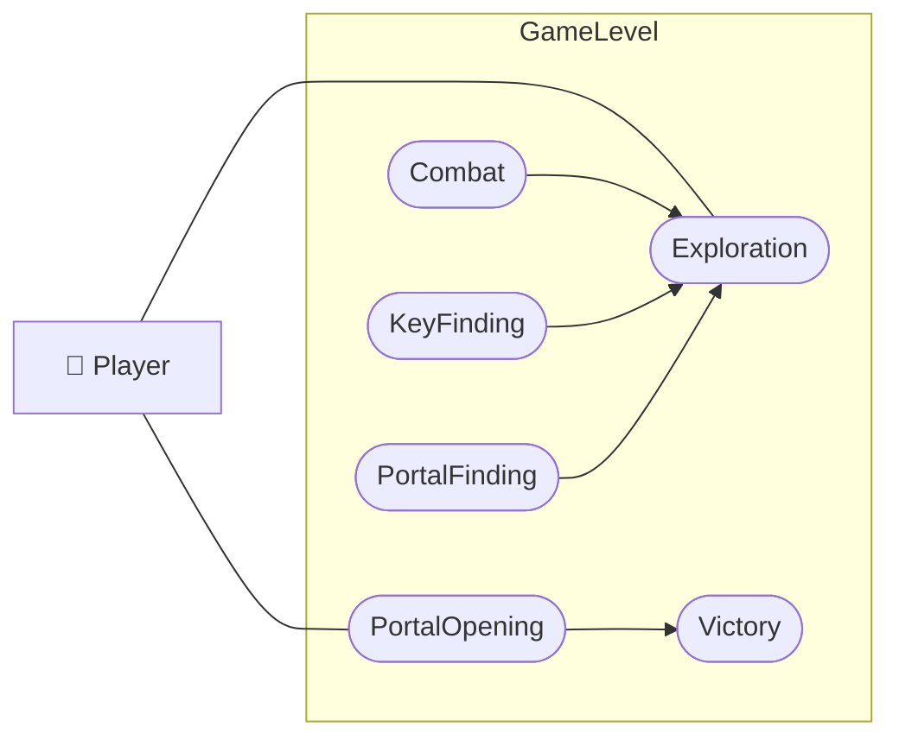

```mermaid
flowchart LR
    Player["👤 Player"]

    subgraph GameLevel["GameLevel"]
        Exploration(["Exploration"])
        Combat(["Combat"])
        KeyFinding(["KeyFinding"])
        PortalFinding(["PortalFinding"])
        PortalOpening(["PortalOpening"])
        Victory(["Victory"])
    end

    Player --- Exploration
    Player --- PortalOpening

    Combat --> Exploration
    KeyFinding --> Exploration
    PortalFinding --> Exploration
    PortalOpening --> Victory

```

