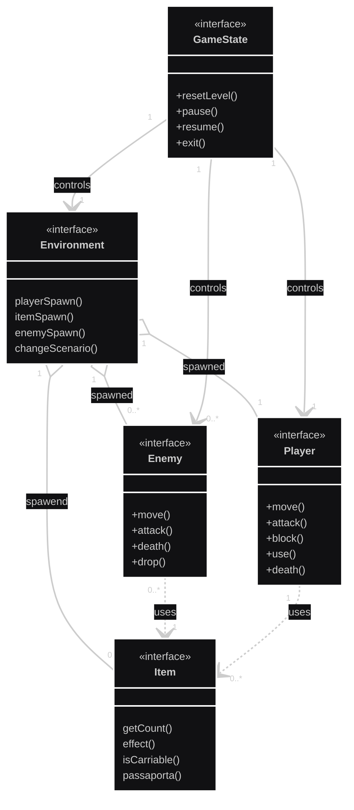

4 entità rilevate: Player, Environment, Enemy, Item, GameState

```mermaid
---
config:
  theme: redux-dark-color
  layout: neo
---

classDiagram

class Player <<interface>> {
  +move()
  +attack()
  +block()
  +use()
  +death()
}

class Item <<interface>> {
  getCount()
  effect()
  isCarriable()
  passaporta()
}

class Environment <<interface>>{
  playerSpawn()
  itemSpawn()
  enemySpawn()
  changeScenario()
}

class Enemy <<interface>> {
  +move()
  +attack()
  +death()
  +drop()
}

class GameState <<interface>> {
  +resetLevel()
  +pause()
  +resume()
  +exit()
}

Environment "1" o-- "1" Player : spawned
Environment "1"  o-- "0..*" Enemy : spawned
Environment "1" o-- "0..*" Item : spawend
GameState "1" --> "1" Environment : controls
GameState "1" --> "1" Player : controls
GameState "1" --> "0..*" Enemy : controls
Enemy "0..*" ..> "1" Item : uses
Player "1" ..> "0..*" Item : uses

```